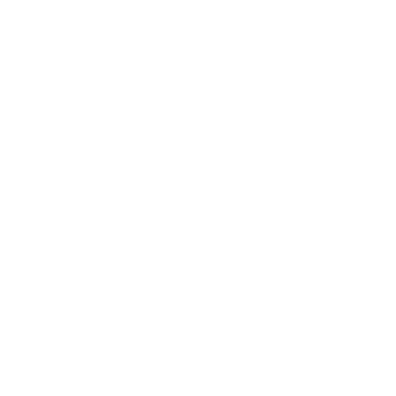
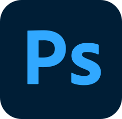
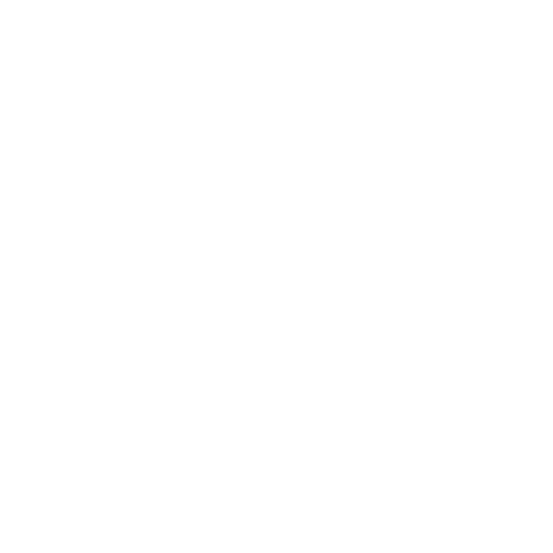

# Hi there! My name is Alejandro

  <h3 style="padding-bottom:10px">
    I design and develop games and other neat stuff 🍅
  </h3>
  

    
    

      

        I'm a <b>Game developer and Designer</b> with a degree in engineering for digital entertainment design with an emphasis on videogames.
      

      

        My goal is to create new and exciting experiences and tell wonderful stories that inspire and entertain the people who play them.
      

      <h3>
        Languages I'm good at:
      </h3>
      

        
        
        
      

      <h3>
        Engines I'm good at:
      </h3>
      

        
        
        
      

      <h3>
        Other stuff I'm good at:
      </h3>
      

        
        
        
        
        
      

    

  

----

&nbsp;
<b style="font-size: 22px;">
  | &nbsp;&nbsp;&nbsp; Website & Gallery :&nbsp;<a href="https://rokneer.github.io/portfolio/">rokneer.github.io/portfolio</a>
</b>
